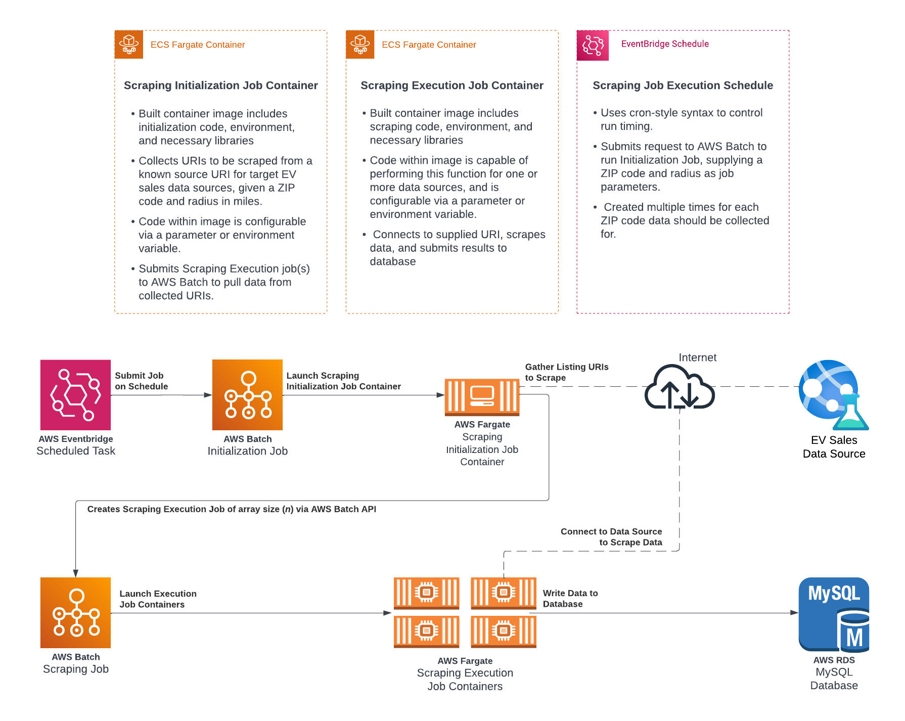

# Batch Data Collector
This Terraform module leverages Amazon Batch, ECS, RDS, and other AWS services to create a robust web scraping solution. Scraping containers are deployed on ECS Fargate and managed by AWS Batch to handle scheduling and execution efficiently.

The scraped data is then written to a centralized database using RDS, or alternatively, to Amazon S3 or other storage solutions. This setup ensures efficient data collection and flexible storage options, enhancing both performance and reliability.

---

# Getting Started with AWS
Amazon Web Services (AWS) is a comprehensive cloud computing platform provided by Amazon, offering a wide array of services including computing power, storage, and databases, to help organizations scale and grow, while providing robust tools for deployment, management, and security of various applications and services.

If you do not already have the AWS CLI configured, you can follow the steps [in our documentation to get it configured](https://special-adventure-5k92rgy.pages.github.io/)

---

# Getting Started with Terraform
HashiCorp Terraform is an open-source infrastructure as code (IaC) tool that enables users to define, provision, and manage cloud and on-premises resources through a high-level configuration language, supporting a wide range of service providers and streamlining the infrastructure deployment process.

If you do not already have Terraform installed and configured, reference [their documentation to get started.](https://developer.hashicorp.com/terraform/tutorials/aws-get-started/install-cli)
  
For the most part, the commands you'll need will be `terraform init`, `terraform plan`, and `terraform apply`

---

# Job Containers
Your job containers are the most important part of the data collection process. These containers will be run automatically at times you specify with any input data you provide to collec the data you're interested in. Environment variables can be provided at both the Batch Job and Eventbridge Task level to provide flexibility. This module optionally creates an Elastic Container Registry for you to push your image to, which can then be referenced in your job definition. (see below) This module also allows you to specify images in other registries should you so choose. 

---

# Defining Your Jobs
Job definitions are the heart of this module, and specify what image runs at what time with what data pre-loaded into it. You may have multiple jobs with multiple schedules with varying starting inputs, or a single job that runs without special configuration; however, at least one job definition is always needed.

VCPU and Memory combinations must be compliant with [Amazon's documentation found here](https://docs.aws.amazon.com/AmazonECS/latest/developerguide/fargate-tasks-services.html#fargate-tasks-size)

An example template for job definitions is as follows. Items encapsulated in [] are mutable. 

```
{ 
  name              = [ job-name ]
  image_uri         = [ identity/image-name:version ]
  vcpus             = [ 1 ]
  memory            = [ 1024 ]
  assign_public_ip  = [ bool ]
  runtime_platform  = [ X86_64 | ARM64 ]
  environment       = [
    {
      name  = [ name_x]
      value = [ value_x ]
    },
    {
      name  = [ name_y ]
      value = [ value_y ]
    }
  }
  ]
  scheduling        = {
    enable            = [ bool ]
    schedule          = [ cron expression ]
    share_identifier  = [ low | medium | high ]
    flex_minutes      = [ number ]
}
```

>**Important!**
> Variable data for your specific deployment will go into a new file called `terraform.tfvars`. Module variables are defined in `variables.tf`, but that file is not intended to be modified.

---

# Deployment
Once you have forke, cloned, and configured this module by creating a `terraform.tfvars` file and filling it out, run `terraform init` on your development host to prime it to create this module's infrastructure. Once the initialization has finished, run `terraform apply` to deploy!

>**Important!**
> To do a dry-run of infrastructure creation , run `terraform plan`. This is extremely helpful for understanding what is being created!

---

# Real-World Application
  
## Use Case
In the example architecture below, the team was looking to collect data from multiple web-based sources on the sales of electric vehicles. After writing the Python code to scrape a single source using values from environment variables, the image, along with the configuration of this module, was able to be utilized to scrape thousands of pages per day to retrieve the necessary data. 

## Architecture 
[](https://special-adventure-pl14j3j.pages.github.io/assets/images/scrape_example.png)
